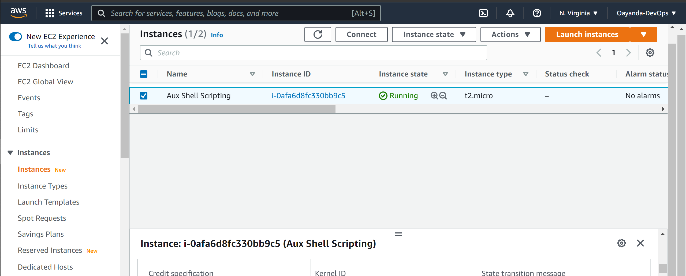
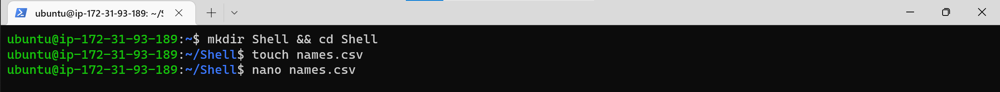

Lunch Linux Server (in this case, Ubuntu server in AWS EC2)

Create a project folder.
```bash
mkdir Shell && cd Shell
```
In the new directory, create csv file - ***names.csv***


Open and populate with names, one entry per line.