Lunch Linux Server (in this case, Ubuntu server in AWS EC2)

Create a project folder.
```bash
mkdir Shell && cd Shell
```
In the new directory, create the following require files - ***names.csv id_rsa.pub onboarding_users.sh***
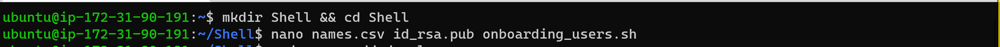

Open and populate with names.csv, one entry per line. Save and exit.
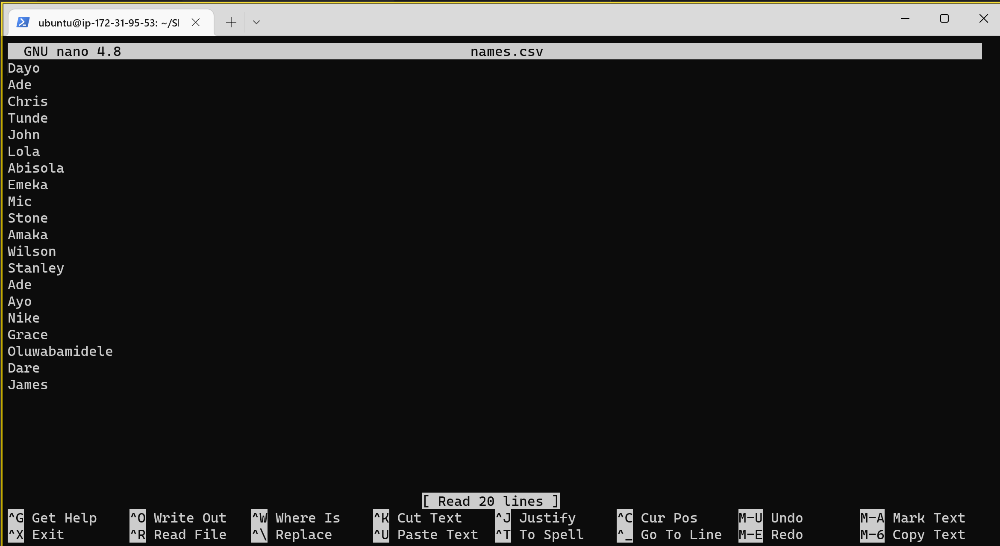

Open and populate the id_rsa.pub file the public key. Save and exit.
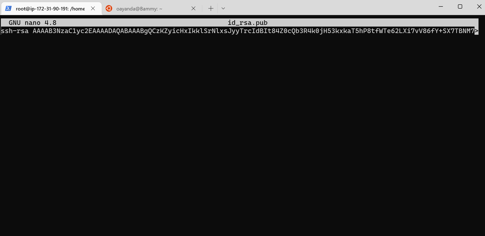

Add shell script to automate the onboarding of 20 users. Save and exit.
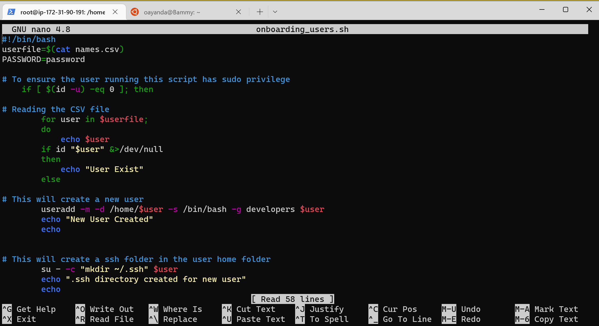


Create the developers group
```bash
sudo groupadd developers
```
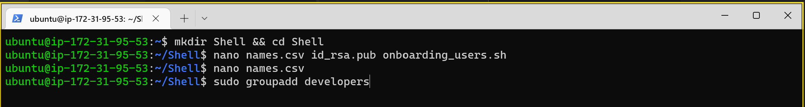

Make the shell script executable
```bash
sudo chmod +x onboarding_users.sh
```


Change user to super and run script.
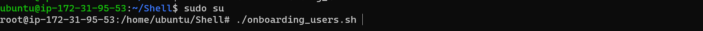

User are created successfully


Verify the new users, 
```bash
cd ../..
```
```bash
ls -la
```
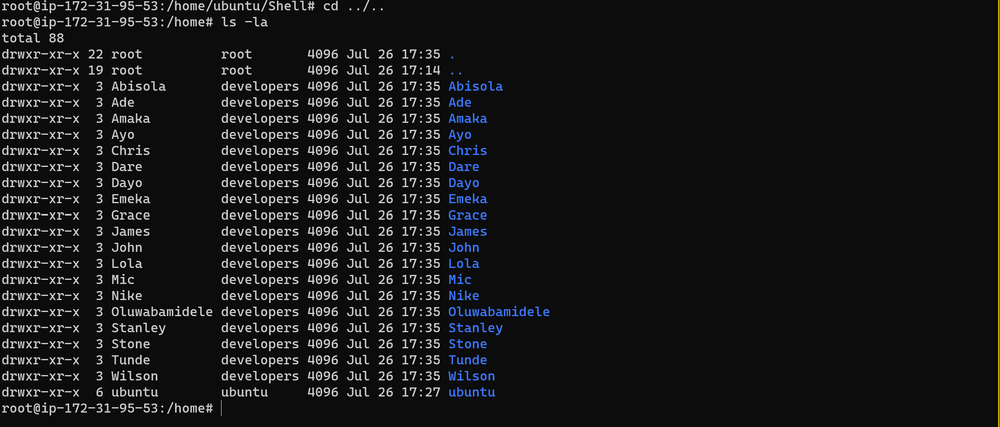

From a window client using putty, Login as James.
Prepare private using PUTTYGEN, copy the private key and save.


Save as private Key
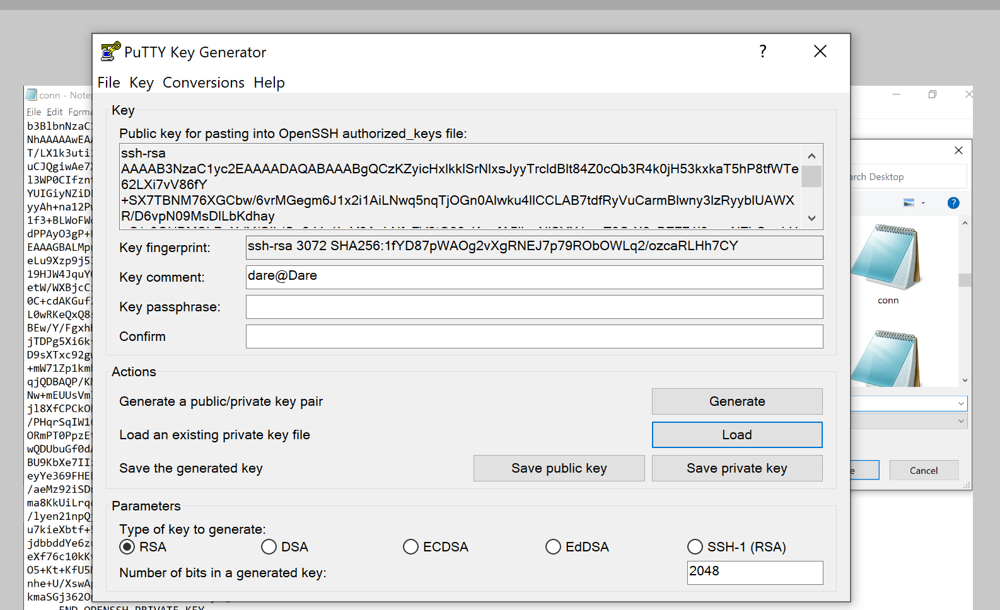

Open PUTTY, click Auth inside the ssh tab, load the just created ppk file.
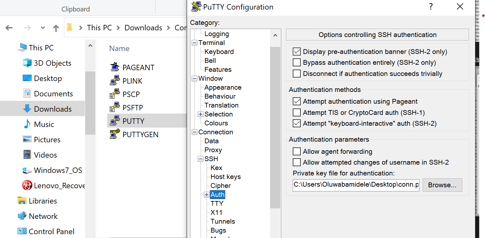

Scroll to the top and click on Session and insert the public ip of the ubuntu server. Click open and accept the prompt
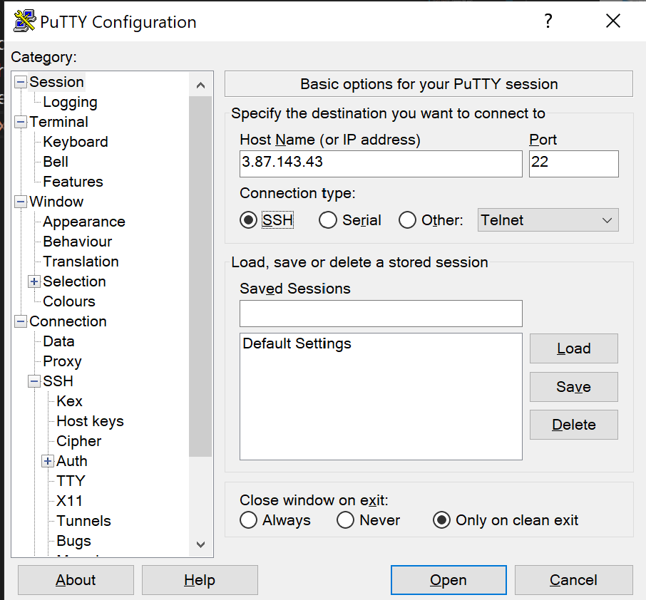

Login as James
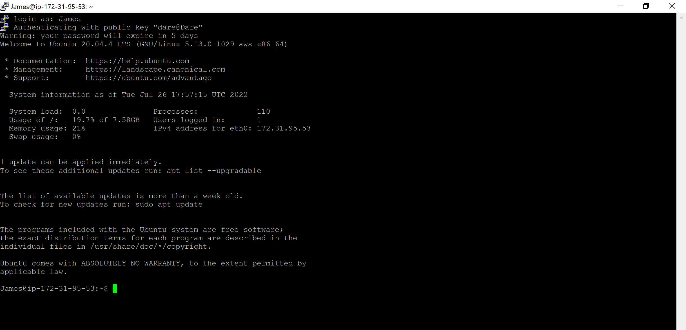

Click to view **[Demo video](https://drive.google.com/file/d/15Rcy48DctwKd7UkBwIgBAdj88PXLiLAe/view?usp=sharing)**